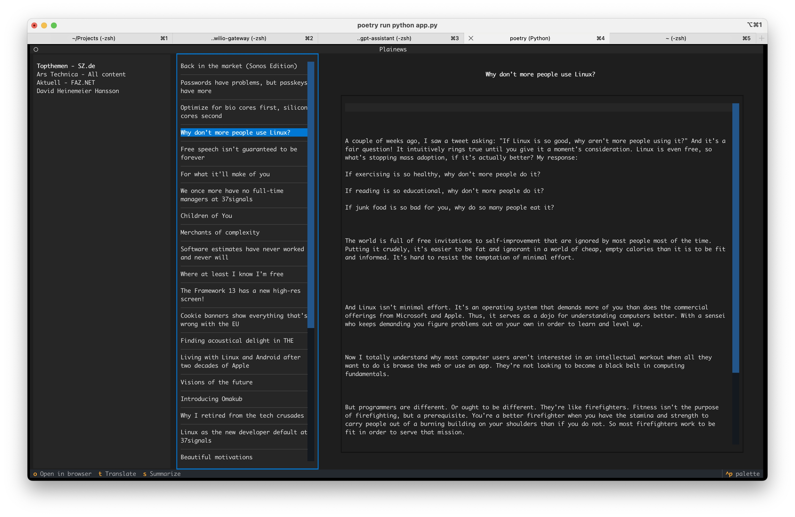

# Plainews
## Distraction and clutter-free publication reading

[](https://badge.fury.io/py/plainews)



Reading news nowadays is broken. We are bombarded with ads to the point where the useful information we actually want to read is hidden away along a sea of upsells, ads and clickbait.

Plainews takes all that nonsense away and lets you focus on what you actually __want to__ read.

### Taking out the trash

We actually have the technology to eliminate the clutter, stop being bombarded with ads and just enjoy our content. Plainews downloads the webpage containing the publication you want to read and uses algorithms that strip away everything but the real, useful information. More on how that's done you will find further down the README.

### Language-agnostic news - expat edition

Decouple language from locale. Sometimes you want to read news local to a region, but you also what to read it another language. Plainews can translate articles to any language you specify in the config.

### Summarizing bloated articles

Some articles are good, but too long. Often times authors beat around the bush or fill their text with information that's just not that interesting. Plainews can summarize articles so you feel up to date, without having to read long articles.

### RSS

Yes, yet another RSS feed reader...
It's just the best way to get updates whenever your favorite blogs and newspapers have new content.

### TUI (Textual User interface)

Plainews rocks a beautiful (in my opinion) terminal interface. Not because I believe this is the future, but rather because I think it looks cool and it was a blast to develop :)

## Configuration

Plainews depends on a configuration file for setting up your experience and the publications you want to read. 

This configuration is a yaml file. It should be located in one of the following locations:
* in the present working directory and named `config.yml`
* in the home directory and named `.plainews.yml`

### Format and available options

Here's the default configuration:

```yaml
llm_model: ollama/llama3.1
llm_base_url: http://localhost:11434
language: english
feeds_file: feeds.pickle
articles_file: articles.pickle
followed_feeds:
    - https://rss.sueddeutsche.de/rss/Topthemen
    - https://feeds.arstechnica.com/arstechnica/index
```

The most important thing is the followed feeds. You need to add RSS feeds that you want to see in the app.
Many options are connected to smart features such as translations and summarization. For this, a LLM is used. If you don't have an account for a commercial one, you can use Ollama, like in this example.

## Running the application

### Dependencies

Poetry is used for dependency management. Before running, you need to make sure these dependencies are installed, either globally or in a (virtual) environment.

```commandline
poetry install
```

### Running the TUI

While being the root of the project, run:

```commandline
poetry run python app.py
```

## Information extractions

From my experience, most of the time the useful information can be extracted from a webpage easily using some locally running libraries. Namely, the [Newspaper3k](https://github.com/codelucas/newspaper/) python library does a fairly good job in this project.
In the future, we might use LLMs to handle the more complicated cases.